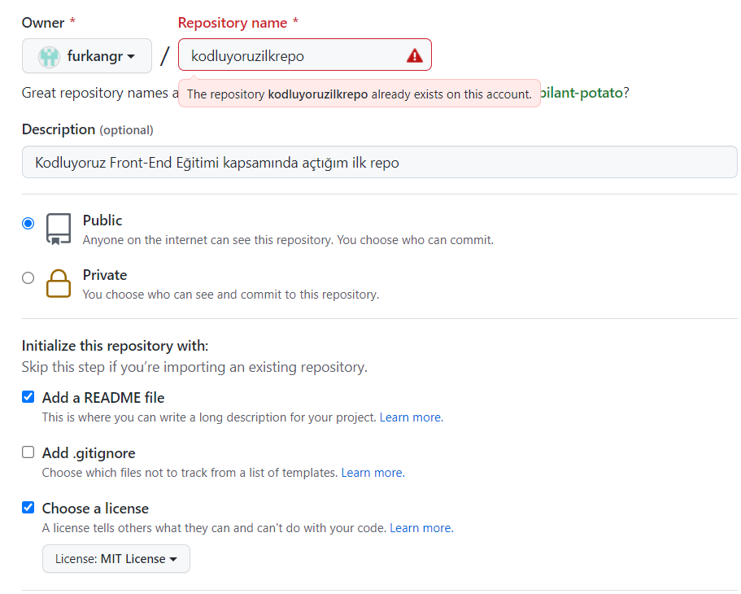

# Kodluyoruz Ilk Repo

Bu repo [Kodluyoruz](https://www.kodluyoruz.org/) Front-End Eğitiminde oluşturduğumuz ilk repo. İçerisinde bir adet README dosyası, bir adet de index.html barındırıyor



## İnstallation

Öncelikle projeyi clonelayın. (https://github.com/furkangr/kodluyoruzilkrepo.git)

Linux için:

```git 
git clone https://github.com/furkangr/kodluyoruzilkrepo.git/ 
```
## Usage

Projeyi cloneladıktan sonra Visual Studio Code programında açınız.

```linux
cd kodluyoruzilkrepo
code
```
## Contributing

Pull requestler kabul edilir. Büyük değişiklikler için, lütfen önce neyi değiştirmek istediğinizi tartışmak için konu açınız.

## License

[MIT](https://choosealicense.com/licenses/mit/)
